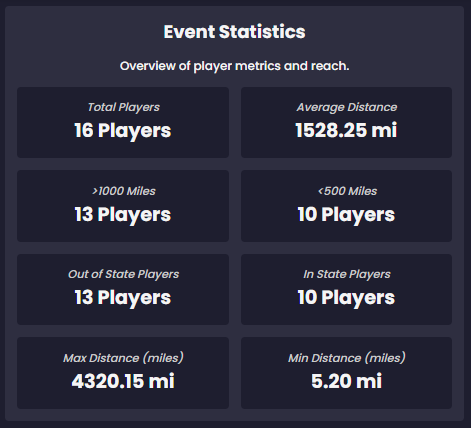

# Event Travel Distance Tool

## Summary

**What does this web application do?**  
This web app is an interactive dashboard that visualizes and analyzes statistics of disc golf events, emphasizing players’ travel distance to those events.

---

## 🟢 Working Features

### Home Page

- **Live Event Filtering:**
  - Tier
  - Country
  - State
  - Start/End Date
  - Min/Max Players
  - Min/Max Average Distance

- **Dynamic Bar Chart** of Events  

- **Map of Events** with On-Click Information  

- **Statistics Overview**  

### Event Page

- **Event Statistics:**
  - Total Players
  - Average Distance of Players to an Event
  - Players Outside 1000 Miles
  - Players Within 500 Miles
  - In and Out of State Players
  - Minimum and Maximum Player Distance Traveled
  - Top Players

- **Bar Chart** showcasing furthest player travel distance  

- **Pie Chart** showcasing number of players per state  

- **Map** with player and event pins with lines to visualize outreach  

---

## 🟡 Partially Working Features

- **Player Location Accuracy**  
  While the web app can calculate distances, it cannot ensure the players' addresses are fully accurate or up to date, potentially causing skewed data.

---

## 🧠 Potential Implementations

- Event Page Filters  
- Event Page Search Bar

---

## 🧱 Architecture

### Tech Stack

**Frontend:**

- HTML
- CSS
- JavaScript  
  - Libraries:
    - Chart.js
    - Leaflet.js

**Backend:**

- PHP
- MySQL

---

## ⚙️ Setup Instructions

### 1. Fork the Repository

### 2. Configure PHP Database Connection

- Adjust the database connection file path to your `db.php`
- Currently set to:  
  `/home/aabualha/db.php`
  

### 3. Deployment Options

#### Option 1: Local (Using cPanel or Web Hosting Tool)

1. Navigate to **File Manager**
   
2. Click on **public_html**
  
4. Click **Upload** and select the project folder
  

#### Option 2: Live Website with Domain (Using cPanel Git Version Control)

1. Go to **Git Version Control**
2. Click on **Create**
3. Ensure **Clone a Repository** is enabled
   
5. Enter:
   - **Clone URL** for the forked repository
   - **Repository Path** as `public_html`
   - **Repo Display Name**
6. Click **Create**

---

## 🔁 Common Tasks

### Updating the Live Website

1. Make and commit code changes  
2. In cPanel, go to **Git Version Control**
   
4. Click **Manage** on the repo
   
5. Go to the **Pull or Deploy** tab
   
6. Click **Update from Remote**
  

### Restarting the Project

- Use `Ctrl + Shift + R` to clear browser cache  
  *(Required to see the latest changes)*
  
---

## 🔧 Status / Backlog

### Not Yet Implemented

- **Address Conversion / Geocoding**  
  (Web app does not convert addresses to latitude/longitude for distance calculations)

- **Filter by Event Concentration**  
  (Filter events by how local/national they are)

- **Player Deficiency Display**  
  (Show events with fewer players than expected, based on local player density or traffic)

---

## 📬 Contact

For questions or support, please contact:

- **Allen:** [allen.resulidze@gmail.com](mailto:allen.resulidze@gmail.com)  
- **Hosea:** [h.nacanaynay@gmail.com](mailto:h.nacanaynay@gmail.com)  
- **Ahmed:** [Alhawar0001@gmail.com](mailto:Alhawar0001@gmail.com)  
- **Kevin:** Email and/or phone (not listed)
